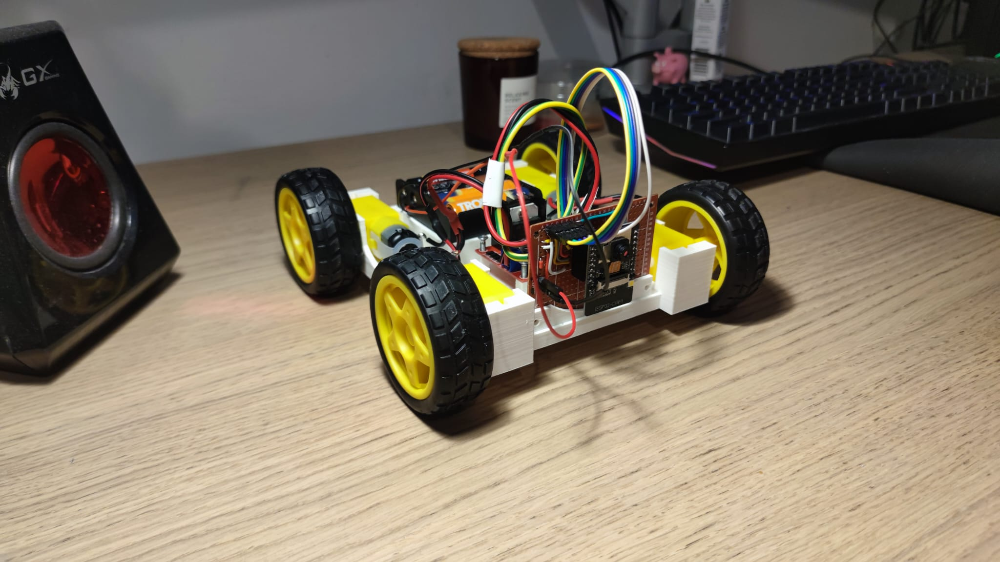
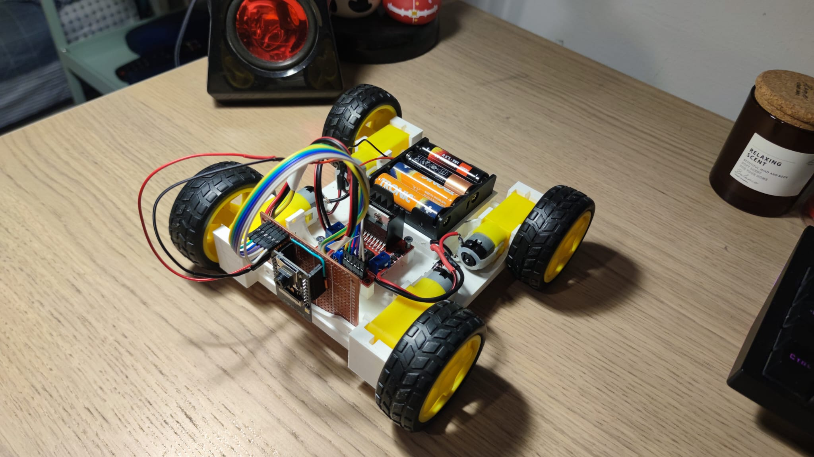
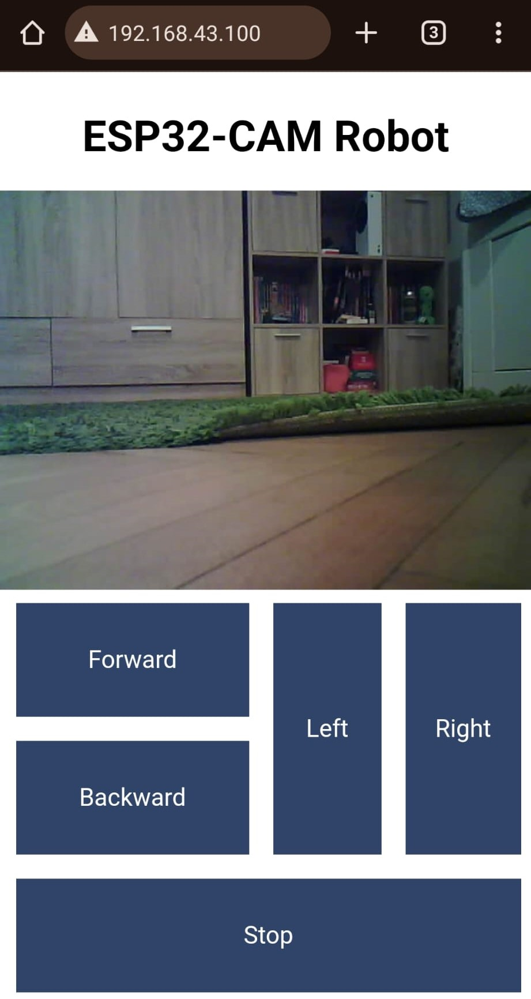

# ESP32-CAM Tank Robot Dokumentáció

# Felhasználói platform bemutatása
Az **ESP32-CAM** egy fejlett, ESP32-alapú fejlesztői modul, amely beépített Wi-Fi és kamera képességekkel rendelkezik. Ideális választás IoT-, AI- és robotikai alkalmazásokhoz. Ez a projekt kihasználja az ESP32-CAM képességeit a motorvezérléshez, a kamera képének streameléséhez, és egy egyszerű webes interfész biztosításához.

### **ESP32-CAM főbb jellemzői**
- **Processzor:** Dual-core Xtensa LX6, akár 240 MHz órajellel.
- **Memória:** 520 KB belső SRAM + opcionális PSRAM (8 MB).
- **Csatlakoztathatóság:** Beépített Wi-Fi (802.11 b/g/n) és Bluetooth.
- **Kamera:** OV2640 támogatás, VGA (640x480) felbontás.
- **GPIO-k:** Rugalmas csatlakozási lehetőségek (pl. motorvezérlés, kameraadatok).
- **Tápfeszültség:** 5V, azonban a projektben 12V-ot használunk a motorok számára.

### **Felhasználási területek**
Az ESP32-CAM gyakran alkalmazott:
- Robotikában (pl. robotkarok, tankok, járművek).
- Biztonsági rendszerekben (IP-kamerák).
- Automatizált IoT eszközökben.


# Tervdokumentáció
### **Kapcsolási rajz és felépítés**
A projektben két pár DC motort használunk, amelyeket egy **L298N H-híd** vezérlő hajt meg. Az ESP32-CAM vezérli a motorokat, valamint a kamera képét streameli. Az alábbi kapcsolási pontok biztosítják az eszköz megfelelő működését:

#### **Kapcsolódások**
1. **ESP32-CAM és motorvezérlő (L298N):**
   - **Bal oldali motor (Motor 1):**
     - IN1 -> GPIO 14
     - IN2 -> GPIO 15
     - ENA -> GPIO 1 (PWM)
   - **Jobb oldali motor (Motor 2):**
     - IN1 -> GPIO 13
     - IN2 -> GPIO 12
     - ENB -> GPIO 2 (PWM)
2. **Kamera kapcsolódása az ESP32-CAM-hez:**
   - Gyári lábkiosztás szerint kötve (lásd `camera_pins.h`).

#### **Energiaellátás**
A motorvezérlő és az ESP32-CAM 12V-os tápegységről működik. Az L298N biztosítja a motorok megfelelő működéséhez szükséges áramot.

### **Alkatrészlista**
| Alkatrész         | Mennyiség | Leírás                           |
|-------------------|-----------|----------------------------------|
| ESP32-CAM         | 1         | Kamera és vezérlőegység         |
| L298N H-híd       | 1         | DC motorvezérlés                |
| DC motor (6-12V)  | 4         | Tank meghajtás                  |
| 12V tápegység     | 1         | Energiaellátás                  |
| Jumper kábelek    | Több      | Csatlakozások                   |
| Alaplap vagy tartó | 1         | Stabil platform                 |


# Megvalósítás és működés leírása
A robot tankstílusú meghajtással működik, amelyet külön motorok vezérelnek. Az ESP32-CAM lehetővé teszi a kamera képének streamelését és a motorok irányítását a felhasználói parancsok alapján.

### **Működési módok**
- **Előre haladás:** Mindkét oldal motorjai azonos sebességgel forognak előre.
- **Hátrafelé haladás:** Mindkét oldal motorjai azonos sebességgel forognak hátrafelé.
- **Jobbra/Balra fordulás:** Az egyik oldalon előre, a másik oldalon hátrafelé forognak a motorok.
- **Enyhe kanyarodás:** Az egyik oldal motorjai csökkentett sebességgel forognak.
- **Stop:** Az összes motor leáll.

#### **Kamera funkciók**
- Élőkép streamelése MJPEG formátumban.
- A webes interfész automatikusan beállítja a kamera URL-jét.

### **Felhasználói élmény**
A webes interfész lehetővé teszi:
1. A robot irányítását egyszerű gombokkal.
2. Az élő kamerakép megtekintését.
3. Az egyes gombok állapotának valós idejű frissítését.

Robot balról               |  Robot fent-jobbról
:-------------------------:|:-------------------------:
    |  


# Beágyazott vezérlő programok
A vezérlés főbb komponensei:
1. **Motorvezérlő osztály (`DCMotor`)**:
   - Motorok sebességét és irányát PWM-mel szabályozza.
   - Támogatja az időzített motorvezérlést (pl. `on(speed, millisec)`).

2. **Callback funkció (`action_callback`)**:
   - HTTP parancsokat dolgoz fel (pl. előre, hátra, jobbra, balra).

3. **Kamera stream handler**:
   - Az `/stream` végponton keresztül továbbítja az MJPEG élőképet.

**Példa: Motorvezérlés megvalósítása:**
```cpp
if (!strcmp(variable, "forward")) {
  motorRight.on(MAX_SPEED);
  motorLeft.on(MAX_SPEED);
}
```

# Felhasználói interfész programok
A webes interfész egy HTML5 oldalt tartalmaz, amely JavaScript segítségével HTTP-kéréseket küld az ESP32-CAM-nek. A felhasználói élmény javítása érdekében a gombok állapota dinamikusan frissül.

### **Felépítés**
- **Kamera stream:** A weboldal automatikusan betölti az ESP32-CAM kamera képét.
- **Irányítási gombok:** Előre, hátra, jobbra, balra, stop.
- **Aszinkron parancsok:** A JavaScript XMLHttpRequest használatával kommunikál a vezérlővel.

**Példa gombok működésére:**
```html
<button id="forward" class="button" 
  onmousedown="pressButton('forward');" 
  onmouseup="releaseButton('forward');">Forward</button>
```



# Programok forráskódja és dokumentációja
A projekt kódja négy fő komponensre bontható: motorvezérlés, kamera inicializálás és streamelés, HTTP kérések kezelése, valamint a felhasználói interfész. Az alábbiakban részletesen elemzem ezeket a részeket.

### 1. **Motorvezérlés: DCMotor osztály**
A `DCMotor` osztály a motorok irányításáért felel. Az osztály a motorok vezérléséhez három GPIO-t használ: két irányjelző pin (`pinA` és `pinB`) és egy PWM jel (`pinS`).

#### **Kód elemzése**
```cpp
class DCMotor {
  private:
    uint8_t pinA;
    uint8_t pinB;
    uint8_t pinS;
  
  public:
    // Konstruktor: inicializálja a GPIO-kat.
    DCMotor(uint8_t pinA, uint8_t pinB, uint8_t pinS) {
      this->pinA = pinA;
      this->pinB = pinB;
      this->pinS = pinS;

      pinMode(this->pinA, OUTPUT);
      pinMode(this->pinB, OUTPUT);
      pinMode(this->pinS, OUTPUT);
    }

    // Motor bekapcsolása adott sebességgel.
    void on(int speed) {
      this->off();  // Biztonságos leállítás az irányváltás előtt.

      // Sebesség határolása (-255 és 255 között).
      speed = constrain(speed, -255, 255);
      
      // Motor irányának beállítása.
      digitalWrite(this->pinA, speed >= 0 ? HIGH : LOW);
      digitalWrite(this->pinB, speed >= 0 ? LOW : HIGH);

      // Sebesség beállítása PWM segítségével.
      analogWrite(this->pinS, abs(speed));
    }

    // Motor kikapcsolása.
    void off() {
      digitalWrite(this->pinA, LOW);
      digitalWrite(this->pinB, LOW);
      analogWrite(this->pinS, 0);
    }
};
```

#### **Funkciók működése**
1. **`on(int speed)`**: Bekapcsolja a motort, a sebesség előjele határozza meg az irányt.
2. **`off()`**: Biztonságosan kikapcsolja a motort azáltal, hogy az összes vezérlő jelet nullázza.
3. **`constrain(speed, -255, 255)`**: Biztosítja, hogy a sebességérték a PWM által támogatott tartományban maradjon.

### 2. **Kamera inicializálás és konfiguráció**
Az ESP32-CAM kamera inicializálása a `initCameraServer` funkcióval történik. Ez a funkció konfigurálja a GPIO-kat, beállítja a frame méretét, és elindítja a Wi-Fi kapcsolatot.

#### **Kód elemzése**
```cpp
void initCameraServer() {
  camera_config_t config;
  config.ledc_channel = LEDC_CHANNEL_0;
  config.ledc_timer = LEDC_TIMER_0;
  config.pin_d0 = Y2_GPIO_NUM;
  config.pin_d1 = Y3_GPIO_NUM;
  config.pin_d2 = Y4_GPIO_NUM;
  config.pin_d3 = Y5_GPIO_NUM;
  config.pin_d4 = Y6_GPIO_NUM;
  config.pin_d5 = Y7_GPIO_NUM;
  config.pin_d6 = Y8_GPIO_NUM;
  config.pin_d7 = Y9_GPIO_NUM;
  config.pin_xclk = XCLK_GPIO_NUM;
  config.pin_pclk = PCLK_GPIO_NUM;
  config.pin_vsync = VSYNC_GPIO_NUM;
  config.pin_href = HREF_GPIO_NUM;
  config.pin_sscb_sda = SIOD_GPIO_NUM;
  config.pin_sscb_scl = SIOC_GPIO_NUM;
  config.pin_pwdn = PWDN_GPIO_NUM;
  config.pin_reset = RESET_GPIO_NUM;
  config.xclk_freq_hz = 20000000;
  config.pixel_format = PIXFORMAT_JPEG; 

  if(psramFound()){
    config.frame_size = FRAMESIZE_VGA;
    config.jpeg_quality = 10;
    config.fb_count = 2;
  } else {
    config.frame_size = FRAMESIZE_SVGA;
    config.jpeg_quality = 12;
    config.fb_count = 1;
  }
  
  // Kamera inicializálása
  esp_err_t err = esp_camera_init(&config);
  if (err != ESP_OK) {
    Serial.printf("Camera init failed with error 0x%x", err);
    return;
  }
}
```

#### **Főbb pontok**
- **Frame méret és minőség:** Az `FRAMESIZE_VGA` és `jpeg_quality` határozza meg a képminőséget és a sávszélességet.
- **Kamera GPIO-k:** A megfelelő kiosztás kritikus a működéshez (lásd `camera_pins.h`).

### 3. **HTTP Kérések Kezelése**
Az ESP32-CAM egy beépített HTTP szervert használ a parancsok fogadására. A `/action` végponton keresztül érkeznek a motorvezérlési utasítások.

#### **Kód elemzése**
```cpp
static esp_err_t cmd_handler(httpd_req_t *req) {
  char* buf;
  size_t buf_len;
  char variable[32] = {0,};
  
  buf_len = httpd_req_get_url_query_len(req) + 1;
  if (buf_len > 1) {
    buf = (char*)malloc(buf_len);
    if (!buf) {
      httpd_resp_send_500(req);
      return ESP_FAIL;
    }
    if (httpd_req_get_url_query_str(req, buf, buf_len) == ESP_OK) {
      if (httpd_query_key_value(buf, "go", variable, sizeof(variable)) == ESP_OK) {
        if (global_callback != nullptr) {
          int res = global_callback(variable);
          if (res != 0) {
            free(buf);
            return httpd_resp_send_500(req);
          }
        }
      } else {
        free(buf);
        httpd_resp_send_404(req);
        return ESP_FAIL;
      }
    }
    free(buf);
  } else {
    httpd_resp_send_404(req);
    return ESP_FAIL;
  }

  httpd_resp_set_hdr(req, "Access-Control-Allow-Origin", "*");
  return httpd_resp_send(req, NULL, 0);
}
```

#### **Funkciók működése**
- Az URI-ból (`/action?go=<action>`) kinyeri a parancsot (pl. `forward`, `backward`).
- A `global_callback` funkció hívásával végrehajtja a megfelelő motorvezérlési utasítást.

### 4. **Felhasználói interfész működése**
A webes interfész lehetővé teszi a robot irányítását, miközben megjeleníti a kameraképet.

#### **Kamera kép beállítása**
```javascript
window.onload = function() {
  document.getElementById("photo").src = window.location.href.slice(0, -1) + ":81/stream";
};
```

#### **Parancsok küldése**
```javascript
function sendAction() {
  let action = "forward";  // Példa akció
  const xhr = new XMLHttpRequest();
  xhr.open("GET", "/action?go=" + action, true);
  xhr.send();
}
```

### 5. **`camera.ino` program részletes elemzése**
A `camera.ino` az ESP32-CAM fő vezérlőprogramja, amely a motorok irányításáért, a kamera inicializálásáért, valamint a felhasználói parancsok feldolgozásáért felelős.

#### **Kód elemzése**
##### **Makrók és inicializálások**
```cpp
#include "soc/soc.h"             // Brownout problémák kikapcsolása
#include "soc/rtc_cntl_reg.h"    // Brownout problémák kikapcsolása

#include <DCMotor.h>
#include "stream.h"

#define MOTOR_1_PIN_1   14
#define MOTOR_1_PIN_2   15
#define MOTOR_1_PIN_EN  1
#define MOTOR_2_PIN_1   13
#define MOTOR_2_PIN_2   12
#define MOTOR_2_PIN_EN  2

#define MAX_SPEED 180
```
- **Brownout detektor:** Az ESP32 stabil működése érdekében kikapcsoljuk.
- **Motorok inicializálása:** A bal és jobb oldali motorok vezérlő GPIO-kat definiáljuk.
- **Sebességkorlát:** A motorok maximális sebessége 180-ra van állítva, amely megfelel a PWM skálázásának.

##### **Motorvezérlési parancsok feldolgozása**
```cpp
int action_callback(char variable[32]) {
  Serial.println(variable);
  if (!strcmp(variable, "forward_right")) {
    motorRight.on(MAX_SPEED / 3);
    motorLeft.on(MAX_SPEED);

  } else if (!strcmp(variable, "forward_left")) {
    motorRight.on(MAX_SPEED);
    motorLeft.on(MAX_SPEED / 3);

  } else if (!strcmp(variable, "backward_right")) {
    motorRight.on(-MAX_SPEED / 3);
    motorLeft.on(-MAX_SPEED);

  } else if (!strcmp(variable, "backward_left")) {
    motorRight.on(-MAX_SPEED);
    motorLeft.on(-MAX_SPEED / 3);

  } else if(!strcmp(variable, "forward")) {
    motorRight.on(MAX_SPEED);
    motorLeft.on(MAX_SPEED);

  } else if(!strcmp(variable, "backward")) {
    motorRight.on(-MAX_SPEED);
    motorLeft.on(-MAX_SPEED);

  } else if(!strcmp(variable, "left")) {
    motorRight.on(-MAX_SPEED);
    motorLeft.on(MAX_SPEED);

  } else if(!strcmp(variable, "right")) {
    motorRight.on(MAX_SPEED);
    motorLeft.on(-MAX_SPEED);

  } else if(!strcmp(variable, "stop")) {
    motorRight.on(0);
    motorLeft.on(0);

  } else {
    return -1; // Hibás parancs
  }
  return 0;
}
```

#### **Funkciók működése**
- A HTTP GET kéréseket (`/action?go=<parancs>`) dolgozza fel.
- Minden irányparancs egyedi motorvezérlési utasítást küld:
  - **`forward_right` / `backward_left`**: Enyhe jobbra-balra mozgás.
  - **`forward` / `backward`**: Egyenes előre-hátra mozgás.
  - **`left` / `right`**: Helyben forgás.
  - **`stop`**: Motorok leállítása.

##### **Setup funkció**
```cpp
void setup() {
  WRITE_PERI_REG(RTC_CNTL_BROWN_OUT_REG, 0); // Brownout detektor kikapcsolása
  
  Serial.begin(115200);
  Serial.setDebugOutput(false);

  motorLeft.off();
  motorRight.off();

  initCameraServer();
  
  // HTTP szerver indítása a parancsok és a kamera stream kezeléséhez
  startCameraServer(action_callback);
}
```

#### **Főbb pontok**
- **Motorok alapállapotba állítása:** Induláskor leállítja a motorokat.
- **HTTP szerver inicializálása:** A `startCameraServer` regisztrálja a parancsok fogadására használt `action_callback` függvényt.


# Következtetések és tapasztalatok
1. Az ESP32-CAM kiválóan alkalmas robotikai projektekhez, kombinálva a kamera és a vezérlési funkciókat.
2. Az L298N H-híd egyszerű és hatékony módja a motorvezérlésnek.
3. A webes interfész gyorsan testreszabható további funkciókkal (pl. sebességállítás, LED vezérlés).


