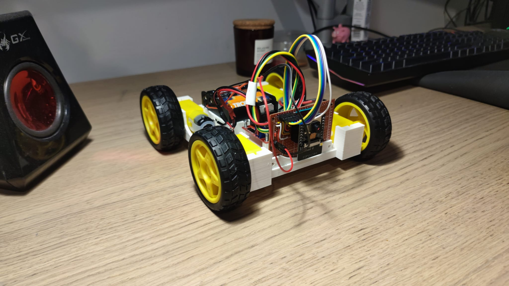
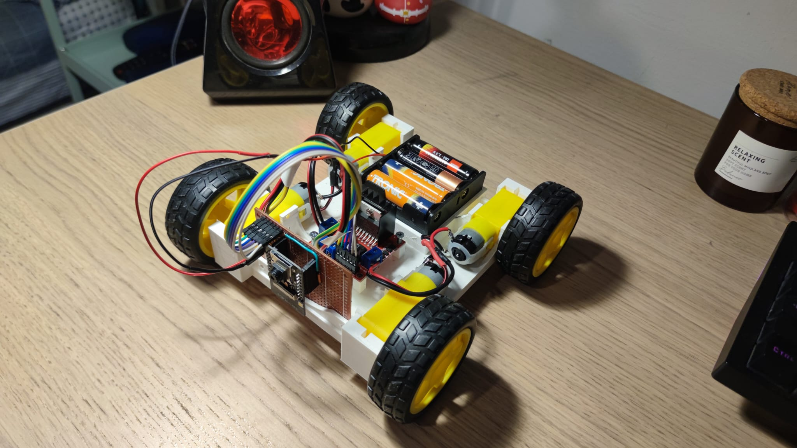
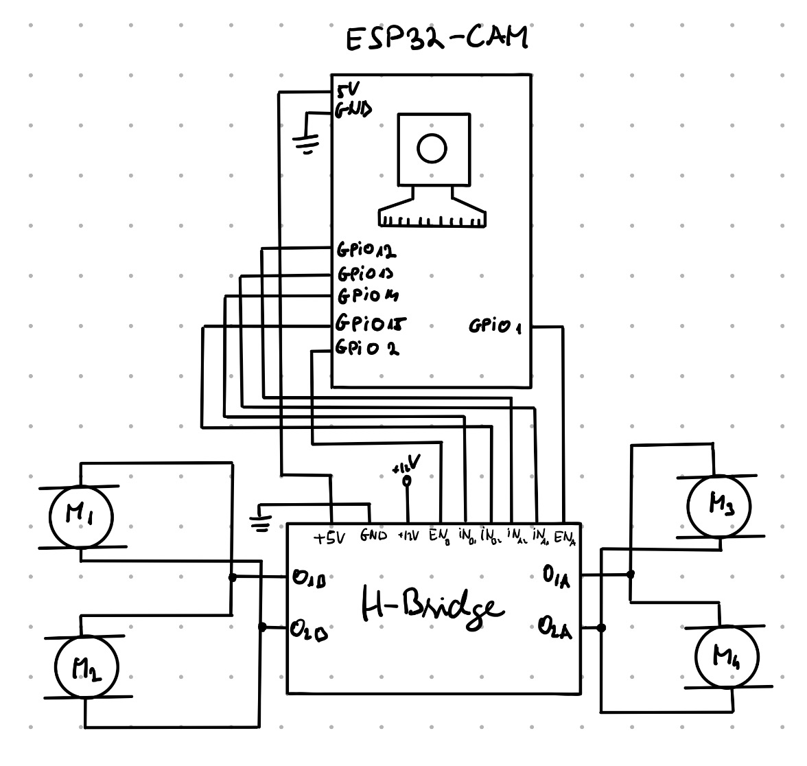
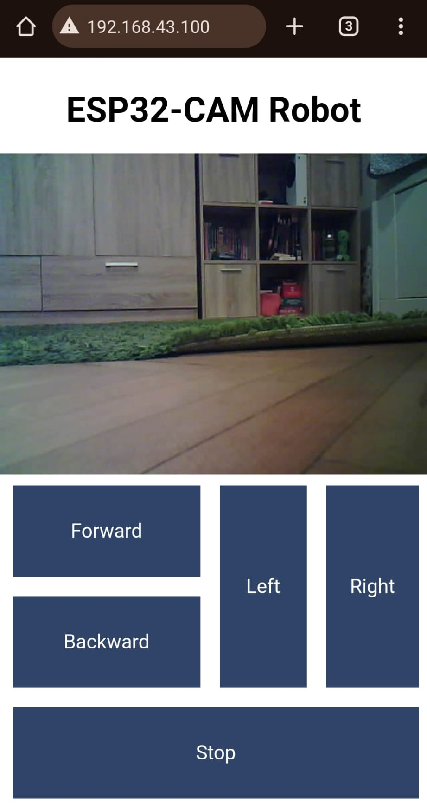

# ESP32-CAM Tank Robot

## Overview

This project implements a web-controlled tank robot using the **ESP32-CAM** module. The robot features real-time video streaming and wireless control via a web interface, making it an ideal platform for robotics education, surveillance applications, and IoT experimentation.

### Key Features

- **Real-time Video Streaming**: MJPEG stream from ESP32-CAM's OV2640 camera
- **Web-based Control**: Intuitive browser interface for robot navigation
- **Tank-style Locomotion**: Differential drive system with four DC motors
- **Wi-Fi Connectivity**: Wireless control and video transmission
- **Low Latency**: Responsive motor control with immediate feedback

## Hardware Platform

### ESP32-CAM Module

The **ESP32-CAM** is an advanced development board based on the ESP32 microcontroller with integrated camera and Wi-Fi capabilities. It is ideal for IoT, AI, and robotics applications.

**Technical Specifications:**
- **Processor**: Dual-core Xtensa LX6, up to 240 MHz
- **Memory**: 520 KB SRAM + optional 8 MB PSRAM
- **Connectivity**: Built-in Wi-Fi (802.11 b/g/n) and Bluetooth
- **Camera**: OV2640 sensor, VGA resolution (640×480)
- **GPIO**: Multiple pins for motor control and peripheral interfacing
- **Power Supply**: 5V input (project uses 12V for motor driver)

**Common Applications:**
- Robotics (robot arms, tanks, autonomous vehicles)
- Security systems (IP cameras, surveillance)
- IoT automation and monitoring

## Hardware Design

### Circuit Diagram and Assembly

The robot uses two pairs of DC motors controlled by an **L298N H-bridge** motor driver. The ESP32-CAM manages motor control and streams video to the web interface.

#### Pin Connections

**ESP32-CAM to L298N Motor Driver:**

| Component | ESP32-CAM Pin | L298N Pin |
|-----------|---------------|-----------|
| Left Motor Direction A | GPIO 14 | IN1 |
| Left Motor Direction B | GPIO 15 | IN2 |
| Left Motor Speed (PWM) | GPIO 1 | ENA |
| Right Motor Direction A | GPIO 13 | IN1 |
| Right Motor Direction B | GPIO 12 | IN2 |
| Right Motor Speed (PWM) | GPIO 2 | ENB |

**Camera Connection:**
- Follows factory pin configuration (see [camera_pins.h](camera_pins.h))

#### Power Supply

- **Input Voltage**: 12V DC power supply
- **Motor Driver**: L298N provides regulated power to motors
- **ESP32-CAM**: Powered through the motor driver's 5V regulator or separate 5V source

### Bill of Materials

| Component | Quantity | Description |
|-----------|----------|-------------|
| ESP32-CAM | 1 | Camera and control module |
| L298N H-Bridge | 1 | DC motor driver |
| DC Motors (6-12V) | 4 | Tank drive motors |
| 12V Power Supply | 1 | Main power source |
| Jumper Wires | Multiple | Connections |
| Chassis/Platform | 1 | Robot frame |

### Assembly Photos

 



## System Architecture

### Operation Modes

The robot implements tank-style differential drive with the following control modes:

| Command | Left Motors | Right Motors | Behavior |
|---------|-------------|--------------|----------|
| **Forward** | MAX_SPEED | MAX_SPEED | Straight forward motion |
| **Backward** | -MAX_SPEED | -MAX_SPEED | Straight backward motion |
| **Right Turn** | MAX_SPEED | -MAX_SPEED | Rotate clockwise in place |
| **Left Turn** | -MAX_SPEED | MAX_SPEED | Rotate counter-clockwise |
| **Forward Right** | MAX_SPEED/3 | MAX_SPEED | Gradual right curve |
| **Forward Left** | MAX_SPEED | MAX_SPEED/3 | Gradual left curve |
| **Backward Right** | -MAX_SPEED/3 | -MAX_SPEED | Reverse right curve |
| **Backward Left** | -MAX_SPEED | -MAX_SPEED/3 | Reverse left curve |
| **Stop** | 0 | 0 | All motors off |

### Camera Functionality

- **Format**: MJPEG streaming
- **Resolution**: VGA (640×480) or SVGA depending on PSRAM availability
- **Stream Endpoint**: `http://<ESP32_IP>:81/stream`
- **Quality**: Configurable JPEG compression (10-12 quality setting)

## Software Implementation

### Project Structure

```
ESP32-robot/
├── camera.ino          # Main program and motor control logic
├── DCMotor.h           # Motor control class header
├── DCMotor.cpp         # Motor control implementation
├── stream.h            # Camera streaming header
├── stream.cpp          # HTTP server and streaming logic
├── html.h              # Web interface HTML
├── camera_pins.h       # Camera GPIO configuration
└── README.md           # Project documentation
```

### Core Components

#### 1. DCMotor Class

The `DCMotor` class provides an abstraction layer for controlling DC motors through an H-bridge driver.

**Features:**
- Bidirectional motor control with speed regulation
- PWM-based speed control (0-255 range)
- Safe direction changes with automatic motor stop

**Key Methods:**
```cpp
DCMotor(uint8_t pinA, uint8_t pinB, uint8_t pinS);  // Constructor
void on(int speed);                                   // Set speed and direction
void on(int speed, int millisec);                     // Timed operation
void off();                                           // Stop motor
```

**Implementation Details:**
- Speed range: -255 (full reverse) to +255 (full forward)
- Positive speed: Motor rotates forward
- Negative speed: Motor rotates backward
- Zero speed: Motor stops
- Uses `constrain()` to ensure values stay within valid PWM range

#### 2. Camera Initialization

The camera subsystem configures the OV2640 sensor and manages video streaming.

**Configuration Parameters:**
```cpp
config.frame_size = FRAMESIZE_VGA;      // 640x480 resolution
config.pixel_format = PIXFORMAT_JPEG;   // JPEG compression
config.jpeg_quality = 10;               // Quality level (0-63, lower is better)
config.fb_count = 2;                    // Frame buffers (if PSRAM available)
config.xclk_freq_hz = 20000000;         // 20MHz clock
```

**Adaptive Quality:**
- **With PSRAM**: VGA resolution, quality 10, dual buffering
- **Without PSRAM**: SVGA resolution, quality 12, single buffer

#### 3. HTTP Server and Control

The web server handles two primary functions:

**Endpoints:**
- `/`: Serves the web interface (HTML page)
- `/stream`: MJPEG video stream on port 81
- `/action?go=<command>`: Motor control commands

**Command Processing:**
The `cmd_handler` function parses URL parameters and executes corresponding motor actions through the `action_callback` function.

**Command Flow:**
```
User clicks button → JavaScript sends HTTP request → ESP32 parses command → 
action_callback executes → Motors respond → HTTP 200 OK returned
```

#### 4. Motor Control Logic

The `action_callback` function in [camera.ino](camera.ino) processes movement commands:

```cpp
int action_callback(char variable[32]) {
  if (!strcmp(variable, "forward")) {
    motorRight.on(MAX_SPEED);    // 180
    motorLeft.on(MAX_SPEED);
  } 
  else if (!strcmp(variable, "backward")) {
    motorRight.on(-MAX_SPEED);
    motorLeft.on(-MAX_SPEED);
  }
  else if (!strcmp(variable, "right")) {
    motorRight.on(MAX_SPEED);
    motorLeft.on(-MAX_SPEED);    // Differential drive
  }
  // ... additional commands
  return 0;  // Success
}
```

**Speed Configuration:**
- `MAX_SPEED`: 180 (70% of maximum PWM value)
- Gentle turns: Use 1/3 speed on one side (60 PWM value)

### Web Interface



The web interface provides an intuitive control panel with:

**Features:**
- Real-time video stream display
- Directional control buttons (8 directions + stop)
- Touch and mouse event support
- Button state feedback (active/inactive styling)
- Responsive design for mobile devices

**Control Mechanism:**
```javascript
function pressButton(action) {
  var xhr = new XMLHttpRequest();
  xhr.open("GET", "/action?go=" + action, true);
  xhr.send();
  
  document.getElementById(action).disabled = true;  // Visual feedback
}

function releaseButton(action) {
  var xhr = new XMLHttpRequest();
  xhr.open("GET", "/action?go=stop", true);
  xhr.send();
  
  document.getElementById(action).disabled = false;
}
```

**Camera Stream Integration:**
```javascript
window.onload = function() {
  var streamUrl = window.location.href.slice(0, -1) + ":81/stream";
  document.getElementById("photo").src = streamUrl;
};
```

### Setup and Initialization

The `setup()` function in [camera.ino](camera.ino) initializes all subsystems:

```cpp
void setup() {
  // Disable brownout detector for stable operation
  WRITE_PERI_REG(RTC_CNTL_BROWN_OUT_REG, 0);
  
  // Initialize serial communication
  Serial.begin(115200);
  
  // Ensure motors are stopped at startup
  motorLeft.off();
  motorRight.off();
  
  // Initialize camera hardware
  initCameraServer();
  
  // Start HTTP server with motor control callback
  startCameraServer(action_callback);
}
```

**Safety Features:**
- Motors are explicitly stopped during initialization
- Brownout detector disabled to prevent unexpected resets
- All GPIO pins configured as outputs before use

## Configuration

### Wi-Fi Settings

Edit [stream.cpp](stream.cpp) to configure your Wi-Fi credentials:

```cpp
const char *ssid = "YourNetworkName";
const char *password = "YourPassword";
```

### Motor Speed Adjustment

Modify the `MAX_SPEED` constant in [camera.ino](camera.ino):

```cpp
#define MAX_SPEED 180  // Range: 0-255
```

### Camera Quality Settings

Adjust in [stream.cpp](stream.cpp) camera initialization:

```cpp
config.jpeg_quality = 10;  // Lower value = better quality (0-63)
config.frame_size = FRAMESIZE_VGA;  // Or FRAMESIZE_SVGA, FRAMESIZE_QVGA
```

## Getting Started

### Prerequisites

- Arduino IDE with ESP32 board support
- ESP32-CAM board with OV2640 camera
- FTDI programmer or USB-to-Serial adapter for initial upload

### Installation Steps

1. **Install ESP32 Board Support:**
   - Open Arduino IDE
   - Go to File → Preferences
   - Add to Additional Board Manager URLs:
     ```
     https://raw.githubusercontent.com/espressif/arduino-esp32/gh-pages/package_esp32_index.json
     ```
   - Go to Tools → Board → Boards Manager
   - Search for "ESP32" and install

2. **Configure Board Settings:**
   - Board: "AI Thinker ESP32-CAM"
   - Upload Speed: 115200
   - Flash Frequency: 80MHz
   - Partition Scheme: "Huge APP (3MB No OTA)"

3. **Upload Code:**
   - Connect FTDI programmer to ESP32-CAM
   - Connect GPIO 0 to GND (programming mode)
   - Upload [camera.ino](camera.ino)
   - Disconnect GPIO 0 from GND
   - Press reset button

4. **Connect to Wi-Fi:**
   - Open Serial Monitor (115200 baud)
   - Note the IP address displayed
   - Open browser and navigate to the IP address

### Hardware Assembly

1. Connect L298N motor driver to motors (2 motors per channel)
2. Wire ESP32-CAM GPIOs to L298N inputs (see pin connections table)
3. Connect 12V power supply to L298N
4. Ensure common ground between ESP32-CAM and L298N
5. Mount all components on chassis

## Usage

1. Power on the robot
2. ESP32-CAM connects to Wi-Fi network
3. Check Serial Monitor for assigned IP address
4. Open web browser on same network
5. Navigate to `http://<ESP32_IP_ADDRESS>`
6. Use control buttons to drive the robot
7. View live camera feed in real-time

## Troubleshooting

### Common Issues

**Camera initialization fails:**
- Verify camera cable is properly connected
- Check GPIO pin definitions match your ESP32-CAM model
- Ensure sufficient power supply (unstable power causes init failures)

**Cannot connect to Wi-Fi:**
- Verify SSID and password in [stream.cpp](stream.cpp)
- Check Wi-Fi network is 2.4GHz (ESP32 doesn't support 5GHz)
- Monitor Serial output for connection status

**Motors don't respond:**
- Verify L298N connections and power supply
- Check GPIO pin definitions in [camera.ino](camera.ino)
- Ensure motor driver is receiving 12V power
- Test motors directly with motor driver before ESP32 integration

**Upload fails:**
- Connect GPIO 0 to GND during upload
- Use correct board settings in Arduino IDE
- Try lower upload speed (115200)
- Check FTDI programmer connections

**Video stream stutters:**
- Reduce JPEG quality (increase quality number)
- Lower frame size (QVGA instead of VGA)
- Improve Wi-Fi signal strength
- Reduce number of connected clients

## Future Enhancements

Potential improvements for the project:

- **Autonomous Navigation**: Implement obstacle detection with ultrasonic sensors
- **Speed Control**: Add adjustable speed slider in web interface
- **Battery Monitoring**: Display battery voltage on web page
- **Recording**: Save video stream to SD card
- **Night Vision**: Add IR LEDs for low-light operation
- **Mobile App**: Develop native iOS/Android application
- **PID Control**: Implement closed-loop motor control for straight-line accuracy
- **Telemetry**: Add IMU sensor for orientation tracking

## License

This project is open-source and available for educational and personal use. The DCMotor library is Copyright (c) 2023 Graziano Blasilli.

## Acknowledgments

- ESP32-CAM community for extensive documentation
- Arduino ESP32 core developers
- Contributors to the ESP-IDF framework

## Technical Specifications Summary

| Parameter | Value |
|-----------|-------|
| Microcontroller | ESP32 Dual-core @ 240MHz |
| Camera | OV2640, VGA (640×480) |
| Motor Control | L298N H-Bridge, PWM |
| Motors | 4× DC Motors (6-12V) |
| Connectivity | Wi-Fi 802.11 b/g/n |
| Power | 12V DC input |
| Video Format | MJPEG streaming |
| Control Interface | Web-based (HTML/JavaScript) |
| Max Motor Speed | 180/255 (70% PWM) |
| Stream Port | 81 (HTTP) |
| Control Port | 80 (HTTP) |

---

**Project Date**: December 2024  
**Platform**: ESP32-CAM (AI Thinker)  
**Status**: Functional prototype


